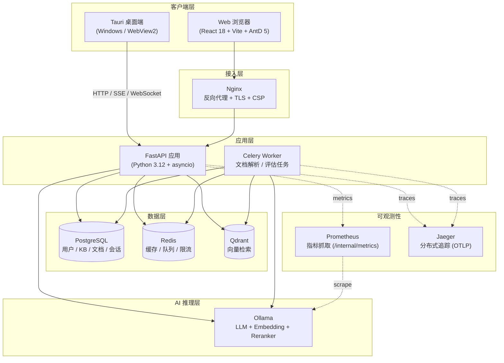

# RAG 知识库问答平台

[](https://github.com/zengjunjin/aiplatform/actions/workflows/backend-ci.yml)
[](https://github.com/zengjunjin/aiplatform/actions/workflows/frontend-ci.yml)
[](https://github.com/zengjunjin/aiplatform/actions/workflows/full-ci.yml)

基于 FastAPI + Qdrant + Ollama 的企业级 RAG (Retrieval-Augmented Generation) 知识库问答系统。

## 功能特性

- **混合检索**: BM25 关键词检索 + 向量相似度检索 + RRF 融合
- **Rerank 重排序**: 基于交叉编码器的结果重排序
- **流式对话**: SSE 流式响应，支持引用来源标注
- **多格式支持**: PDF、DOCX、Markdown、TXT 文档解析
- **RBAC 权限**: 管理员/用户角色权限控制
- **JWT 认证**: Token 黑名单 + 刷新令牌机制
- **限流保护**: API 速率限制，防止滥用
- **异步处理**: Celery 异步文档解析和向量入库
- **数据库迁移**: Alembic 版本化数据库 schema 管理

## 技术栈

| 组件 | 技术 |
|------|------|
| 后端框架 | FastAPI (Python 3.12) |
| 数据库 | PostgreSQL + SQLAlchemy 2.0 |
| 缓存/队列 | Redis + Celery |
| 向量库 | Qdrant |
| LLM | Ollama (兼容 OpenAI API) |
| ORM/迁移 | SQLAlchemy + Alembic |
| 认证 | JWT (access + refresh) |

## 架构图



**关键链路**：

1. **问答流**：用户在 Web / Tauri 发起问答 → Nginx 反代到 FastAPI → BM25 关键词检索 + Qdrant 向量检索 → RRF 融合 → Reranker 重排序 → Ollama LLM 流式生成 → SSE 推送回前端
2. **文档流**：FastAPI 接收上传 → 落盘到 `storage/` → 投递 Celery 任务 → Celery 调用 Ollama Embedding + 写入 Qdrant + 更新 PostgreSQL
3. **可观测性**：Prometheus 抓取 `/internal/metrics`，OTel SDK 自动埋点 FastAPI / SQLAlchemy / Celery / httpx 调用并上报 Jaeger，结构化日志通过 `contextvars` 注入 `request_id`
4. **鉴权**：JWT（iss=rag-platform, aud=rag-client）+ Redis 黑名单 + 单次刷新令牌 + 速率限制（60/min 默认，5/h 重解析等高成本端点更严）

## 快速开始

### 便捷命令 (Makefile)

项目在 `deploy/` 目录提供了 Makefile，简化常用操作：

```bash
make up        # 启动所有服务 (docker-compose up -d)
make down      # 停止所有服务
make logs      # 查看后端和 worker 日志 (实时跟踪)
make migrate   # 执行数据库迁移 (alembic upgrade head)
make restart   # 重启后端和 worker
make init-models  # 拉取 Ollama 模型 (qwen2.5:7b 等)
make test      # 运行后端单元测试
make clean     # 清理所有容器和数据卷
```

> 提示: Makefile 会自动 `cd deploy && docker-compose ...`，无需手动切换目录。

### 方式一: Docker Compose (推荐)

```bash
# 克隆项目后进入目录
cd aiplatform

# 启动所有服务
docker-compose up -d

# 初始化数据库
docker-compose exec backend alembic upgrade head

# 创建管理员账号
# 管理员密码通过 INITIAL_ADMIN_PASSWORD 环境变量设置，未设置时自动生成随机密码
docker-compose exec backend python init_db.py
# 或显式指定密码：docker-compose exec -e INITIAL_ADMIN_PASSWORD=your-strong-password backend python init_db.py
```

访问: http://localhost:8000

### 方式二: 本地开发

#### 前置依赖

- Python 3.12+
- PostgreSQL 14+
- Redis 7+
- Qdrant (可选，使用持久化模式)
- Ollama (运行 LLM)

#### 安装步骤

```bash
cd backend

# 安装依赖
pip install poetry
poetry install

# 配置环境变量（.env.example 实际位于 backend/ 目录）
cp ../backend/.env.example .env
# 编辑 .env 填入你的配置

# 数据库迁移
poetry run alembic upgrade head

# 创建管理员（密码通过 INITIAL_ADMIN_PASSWORD 环境变量设置，未设置时自动生成随机密码）
poetry run python init_db.py
# 或显式指定密码：INITIAL_ADMIN_PASSWORD=your-strong-password poetry run python init_db.py

# 启动后端
poetry run uvicorn app.main:app --reload

# 启动 Celery worker (另开终端)
poetry run celery -A app.core.celery_app worker --loglevel=info

# 启动前端 (另开终端)
cd ../frontend
npm install
npm run tauri:dev   # 桌面应用 (Tauri)
# 或
npm run dev         # 仅 Web 模式
```

## API 文档

启动后访问:
- Swagger UI: http://localhost:8000/docs
- ReDoc: http://localhost:8000/redoc

## 主要 API

### 认证
- `POST /api/v1/auth/register` - 用户注册
- `POST /api/v1/auth/login` - 用户登录
- `POST /api/v1/auth/logout` - 用户登出
- `POST /api/v1/auth/refresh` - 刷新 Token

### 知识库
- `GET /api/v1/knowledge-bases` - 知识库列表
- `POST /api/v1/knowledge-bases` - 创建知识库
- `DELETE /api/v1/knowledge-bases/{id}` - 删除知识库

### 文档
- `POST /api/v1/knowledge-bases/{kb_id}/documents/upload` - 上传文档
- `GET /api/v1/knowledge-bases/{kb_id}/documents` - 文档列表
- `DELETE /api/v1/documents/{doc_id}` - 删除文档
- `POST /api/v1/documents/{doc_id}/reparse` - 重新解析

### 对话
- `GET /api/v1/chat/sessions` - 会话列表
- `POST /api/v1/chat/sessions` - 创建会话
- `POST /api/v1/chat/sessions/{session_id}/messages` - 发送消息（流式 SSE）

### 系统
- `GET /healthz` - 存活探针 (liveness)
- `GET /readyz` - 就绪探针 (readiness)
- `GET /api/v1/system/status` - 系统状态（需管理员）

## 项目结构

```
aiplatform/
├── backend/
│   ├── app/
│   │   ├── api/              # API 路由
│   │   │   ├── deps.py
│   │   │   └── v1/
│   │   │       ├── auth.py
│   │   │       ├── chat.py
│   │   │       ├── documents.py
│   │   │       ├── evaluation.py
│   │   │       ├── knowledge_bases.py
│   │   │       ├── router.py
│   │   │       ├── system.py
│   │   │       ├── users.py
│   │   │       └── ws.py
│   │   ├── core/             # 核心模块
│   │   │   ├── cache.py
│   │   │   ├── errors.py
│   │   │   ├── evaluation.py
│   │   │   ├── events.py
│   │   │   ├── exceptions.py
│   │   │   ├── health_checks.py
│   │   │   ├── metrics.py
│   │   │   ├── middleware.py
│   │   │   ├── model_health.py
│   │   │   ├── model_router.py
│   │   │   ├── notification_manager.py
│   │   │   ├── prompt_optimizer.py
│   │   │   ├── redis_scripts.py
│   │   │   └── security.py
│   │   ├── db/               # 数据库模型
│   │   │   ├── audit_log.py
│   │   │   ├── base.py
│   │   │   ├── chat_message.py
│   │   │   ├── chat_session.py
│   │   │   ├── document.py
│   │   │   ├── document_chunk.py
│   │   │   ├── evaluation.py
│   │   │   ├── feedback.py
│   │   │   ├── knowledge_base.py
│   │   │   ├── prompt_template.py
│   │   │   ├── sync_session.py
│   │   │   └── user.py
│   │   ├── models/           # 模型工厂 / Provider
│   │   │   ├── base.py
│   │   │   ├── cached_embedding.py
│   │   │   ├── factory.py
│   │   │   ├── ollama_provider.py
│   │   │   ├── openai_compatible_provider.py
│   │   │   └── reranker_provider.py
│   │   ├── parsers/          # 文档解析
│   │   │   ├── base.py
│   │   │   ├── chunker.py
│   │   │   ├── docx_parser.py
│   │   │   ├── markdown_parser.py
│   │   │   ├── pdf_parser.py
│   │   │   ├── text_like_parser.py
│   │   │   └── text_parser.py
│   │   ├── rag/              # RAG 核心
│   │   │   ├── bm25.py
│   │   │   ├── context_manager.py
│   │   │   ├── prompt_builder.py
│   │   │   ├── query_rewriter.py
│   │   │   ├── reference_parser.py
│   │   │   ├── reranker.py
│   │   │   └── retriever.py
│   │   ├── schemas/          # Pydantic 请求/响应模型
│   │   │   ├── auth.py
│   │   │   ├── chat.py
│   │   │   ├── common.py
│   │   │   ├── document.py
│   │   │   ├── feedback.py
│   │   │   ├── kb.py
│   │   │   └── user.py
│   │   ├── services/         # 业务服务
│   │   │   ├── audit_service.py
│   │   │   ├── auth_service.py
│   │   │   ├── chat_service.py
│   │   │   ├── document_service.py
│   │   │   ├── evaluation_service.py
│   │   │   ├── feedback_service.py
│   │   │   ├── kb_service.py
│   │   │   └── user_service.py
│   │   ├── tasks/            # 异步任务 (Celery)
│   │   │   ├── celery_app.py
│   │   │   ├── document_task.py
│   │   │   ├── evaluation_task.py
│   │   │   ├── feedback_analysis_task.py
│   │   │   ├── metrics_collector.py
│   │   │   └── scheduled_evaluation.py
│   │   ├── utils/            # 工具
│   │   │   ├── storage.py
│   │   │   └── token_counter.py
│   │   ├── config.py         # 配置
│   │   ├── database.py       # 数据库连接
│   │   ├── redis_client.py   # Redis 客户端
│   │   └── main.py           # 应用入口
│   ├── alembic/              # 数据库迁移
│   ├── tests/                # 单元测试
│   ├── storage/              # 上传文件存储
│   └── pyproject.toml
├── frontend/                 # 前端 (React + Tauri)
│   ├── src/
│   │   ├── api/
│   │   ├── store/
│   │   ├── pages/
│   │   └── components/
│   ├── src-tauri/            # Tauri 桌面应用
│   └── package.json
├── deploy/                   # 部署配置
│   ├── Makefile
│   ├── docker-compose.yml
│   └── nginx.conf
└── docker-compose.yml
```

## 单元测试

```bash
cd backend
poetry run pytest tests/ -v --cov=app
```

核心模块覆盖率（最新基线：后端总覆盖率 82.08%，前端 branches 覆盖率 60%+，2026-07-25 CI 全量回归 后端 873 passed / 0 failed，前端 466 passed / 0 failed）:
- `app.core.security`: 100%
- `app.rag.prompt_builder`: 97%
- `app.rag.reference_parser`: 100%
- `app.parsers.base`: 100%
- `app.parsers.chunker`: 90%
- `app.rag.bm25`: 83%
- `app.services.user_service`: 100%
- `app.services.chat_service`: 98%

## 配置说明

完整配置项请参考 `backend/.env.example`，核心环境变量如下：

| 环境变量 | 说明 | 默认值 |
|----------|------|--------|
| `POSTGRES_HOST` / `POSTGRES_PORT` / `POSTGRES_USER` / `POSTGRES_PASSWORD` / `POSTGRES_DB` | PostgreSQL 连接参数 | localhost:5432, rag, <must-be-set>, rag_platform |
| `REDIS_HOST` / `REDIS_PORT` / `REDIS_DB` | Redis 连接参数 | localhost:6379/0 |
| `QDRANT_HOST` / `QDRANT_PORT` | Qdrant 地址 | localhost:6333 |
| `JWT_SECRET` | JWT 签名密钥（至少 32 字符） | - |
| `JWT_ISSUER` / `JWT_AUDIENCE` | JWT iss/aud 校验 | rag-platform / rag-client |
| `OLLAMA_HOST` | Ollama API 地址 | http://localhost:11434 |
| `LLM_MODEL` | LLM 模型名 | qwen2.5:7b |
| `EMBEDDING_MODEL` / `EMBEDDING_DIM` | Embedding 模型与维度 | bge-m3 / 1024 |
| `CHUNK_SIZE` | 文本分块大小 | 512 |
| `RETRIEVAL_TOP_K` | 检索返回数量 | 10 |
| `CELERY_BROKER_URL` / `CELERY_RESULT_BACKEND` | Celery 消息队列与结果后端 | redis://localhost:6379/1, redis://localhost:6379/2 |
| `METRICS_TOKEN` | Prometheus metrics 抓取 token（`/internal/metrics` 鉴权） | - |

## 安全说明

- 生产环境必须修改 `JWT_SECRET`（至少 32 字符的强随机字符串）
- 生产环境必须修改 `POSTGRES_PASSWORD`（避免使用弱密码黑名单中的值）
- 默认管理员账号请及时修改密码
- 所有 API 均经过认证授权校验
- JWT Token 支持黑名单机制
- API 限流防止暴力攻击

## 架构决策记录 (ADR)

本项目的重要架构决策以 ADR（Architecture Decision Record）形式记录在 `docs/adr/` 目录中：

| ADR | 标题 | 决策 |
|-----|------|------|
| [ADR-001](docs/adr/ADR-001-fastapi-over-django-flask.md) | 为何选择 FastAPI 而非 Django/Flask | FastAPI：异步支持、高性能、自动文档生成 |
| [ADR-002](docs/adr/ADR-002-qdrant-over-milvus-weaviate-pinecone.md) | 为何选择 Qdrant 而非 Milvus/Weaviate/Pinecone | Qdrant：轻量、Rust 实现、本地部署友好 |
| [ADR-003](docs/adr/ADR-003-diy-rag-over-langchain-llamaindex.md) | 为何自建 RAG 管线而非使用 LangChain/LlamaIndex | 自建：避免框架锁定、深入理解原理 |
| [ADR-004](docs/adr/ADR-004-sse-over-websocket-for-streaming.md) | 为何选择 SSE 而非 WebSocket 做流式生成 | SSE：单向数据流、HTTP 兼容、实现简单 |
| [ADR-005](docs/adr/ADR-005-hybrid-retrieval-over-pure-vector.md) | 为何选择混合检索而非纯向量检索 | BM25 + 向量 + RRF：关键词与语义互补 |
| [ADR-006](docs/adr/ADR-006-websocket-vs-sse.md) | 明确 WebSocket 与 SSE 的职责边界 | WebSocket 用于双向通知，SSE 用于流式生成 |
| [ADR-007](docs/adr/007-observability-stack.md) | 可观测性技术栈选型 | OpenTelemetry（OTLP/HTTP）+ Jaeger all-in-one，环境变量驱动启用 |
| [ADR-008](docs/adr/008-secret-management.md) | 密钥管理决策 | 环境变量 + Pydantic `model_post_init` 弱值黑名单校验（非 DEBUG 模式 raise） |
| [ADR-009](docs/adr/009-tauri-updater.md) | Tauri 自动更新方案 | tauri-plugin-updater + 签名证书 thumbprint + 公钥校验 |

新增 ADR 请使用 [TEMPLATE.md](docs/adr/TEMPLATE.md) 模板。

## Contributing

请阅读 [CONTRIBUTING.md](CONTRIBUTING.md) 了解协作流程，关键约定如下：

- **Conventional Commits**：`feat(scope): ...` / `fix(scope): ...` / `chore(scope): ...` / `docs(scope): ...` / `refactor(scope): ...` / `test(scope): ...` / `perf(scope): ...` / `ci(scope): ...` / `build(scope): ...` / `security(scope): ...`，scope 对照表见 CONTRIBUTING.md
- **PR 流程**：fork → 切 feature branch（命名 `feat/xxx` / `fix/xxx`）→ 提 PR → CI 通过 → review → merge；PR 模板包含 Breaking Changes / Test Plan / Checklist
- **Coverage 门槛**：
  - 后端 ≥ 70%（`backend/pyproject.toml` 中 `--cov-fail-under=70`）
  - 前端 lines / statements / functions ≥ 70% / branches ≥ 60%（`frontend/vitest.config.ts`）
- **测试约定**：新增功能必须配套单测；bug 修复必须先写复现测试；E2E 测试新增 `tests/e2e/test_NN_xxx_e2e.py`，编号自增
- **安全约束**：
  - 禁止提交 `.env` / `JWT_SECRET` / `POSTGRES_PASSWORD` 等密钥到 git
  - Tauri `additionalBrowserArgs` 不得包含 `--remote-debugging-port=9222`（RCE 风险）
  - `withGlobalTauri` 必须为 `false`
  - 任何前端 URL 处理使用 MarkdownRenderer 的 urlTransform 白名单（仅允许 http/https/mailto）
- **架构决策记录**：重大架构变更需在 `docs/adr/` 新增 ADR，使用 [TEMPLATE.md](docs/adr/TEMPLATE.md)；现有 ADR 001-009 涵盖 FastAPI/Qdrant/RAG 自建/SSE/WebSocket/混合检索/OTel/密钥管理/Tauri updater 决策
- **Project Memory**：重大约束 / 经验教训请同步写入 `~/.trae-cn/memory/projects/<project>/project_memory.md`，避免未来重蹈覆辙

## License

[MIT](LICENSE) © 2026 zengjunjin
