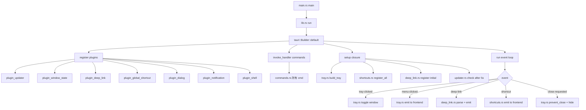

# H17: Tauri 业务逻辑架构设计

> 48 小时执行计划第 17 小时产物 · H18-H22 实施施工蓝图
> 日期：2026-07-26
> 范围：窗口管理 / 系统托盘 / 深度链接 / 自动更新 / 全局快捷键 五大模块
> 约束：本文档仅做设计，不编写 Rust 代码、不安装依赖、不修改 tauri.conf.json

---

## 1. 当前状态审计结果

### 1.1 Rust 侧审计

| 文件 | 现状 | 业务逻辑 |
|------|------|----------|
| `frontend/src-tauri/src/main.rs` | 8 行默认模板 | 仅 `tauri::Builder::default().run(...)`，零业务代码 |
| `frontend/src-tauri/Cargo.toml` | 4 个依赖 | `tauri=2`（features 空）/ `tauri-plugin-updater=2` / `serde=1` / `serde_json=1` |
| `frontend/src-tauri/tauri.conf.json` | NSIS + CDP 9223 + CSP | `plugins: {}` 空；`app.windows[0]` 无 `label`；`app.trayIcon` 不存在 |

### 1.2 前端侧审计

| 文件 | 现状 | 说明 |
|------|------|------|
| `frontend/package.json` | `@tauri-apps/api ^2.11.1` 在 **devDependencies** | ⚠️ 位置错误，运行时通过动态 import 消费，应迁到 `dependencies` |
| `frontend/package.json` | `@tauri-apps/cli ^2.0.0` 在 devDependencies | ✅ 正确（仅构建期使用） |
| `frontend/package.json` | 所有 `@tauri-apps/plugin-*` 缺失 | 需新增 7 个 plugin 包 |
| `frontend/src/utils/tauri.ts` | 已有 78 行基础封装 | 提供 `isTauri()` / `readLocalFile()` / `getAppDataDir()` / `setWindowTitle()` / `closeWindow()` |
| `frontend/src/__tests__/utils/tauri.test.ts` | 已有测试 | 覆盖 isTauri 各分支，但无 plugin 测试 |
| 全局 grep `from '@tauri-apps'` | **0 命中** | 现有 `tauri.ts` 是孤立工具文件，尚未被业务代码消费 |

### 1.3 现有 Tauri 集成模式（必须保持）

`frontend/src/utils/tauri.ts` 使用动态 import 规避 Vite 构建期静态分析：

```typescript
// 使用变量名让 Vite 不在构建时预解析
const TAURI_WINDOW = '@tauri-apps/api/window';
const mod = await import(/* @vite-ignore */ TAURI_WINDOW);
```

**H18-H22 实施时所有新增 hooks 必须延续此模式**，否则浏览器构建（`vite build`）会因找不到 `@tauri-apps/*` 模块而失败。

### 1.4 ADR-009 已确立的硬约束

参考 `docs/adr/009-tauri-updater.md`：

| 约束 | 决策 | 本文档影响 |
|------|------|-----------|
| `--allow-running-insecure-content` | 保留 | CSP 仅放行 `localhost:8000`，更新模块需追加 GitHub Releases 域名 |
| Updater 端点 | GitHub Releases `latest.json` | `connect-src` 必须放行 `https://github.com` `https://*.githubusercontent.com` |
| Updater pubkey | 占位符 `PLACEHOLDER_REPLACE_WITH_REAL_UPDATER_PUBLIC_KEY_BASE64` | 沿用，生产前替换 |
| `windows.installMode` | `passive` | 沿用 |
| 代码签名证书 thumbprint | 占位符 40 位 0 | 沿用 |

### 1.5 依赖对照表

| 模块 | Rust crate | 当前状态 | 前端 npm 包 | 当前状态 |
|------|-----------|----------|-------------|----------|
| 核心 API | `tauri = "2"` | ✅ 已有（features 空） | `@tauri-apps/api` | ⚠️ 在 devDependencies |
| 窗口管理 | `tauri-plugin-window-state = "2"` | ❌ 缺失 | `@tauri-apps/plugin-window-state` | ❌ 缺失 |
| 系统托盘 | `tauri` features `["tray-icon"]` | ❌ features 未启用 | （核心 API 内置） | — |
| 深度链接 | `tauri-plugin-deep-link = "2"` | ❌ 缺失 | `@tauri-apps/plugin-deep-link` | ❌ 缺失 |
| 自动更新 | `tauri-plugin-updater = "2"` | ✅ 已有 | `@tauri-apps/plugin-updater` | ❌ 缺失 |
| 全局快捷键 | `tauri-plugin-global-shortcut = "2"` | ❌ 缺失 | `@tauri-apps/plugin-global-shortcut` | ❌ 缺失 |
| 对话框（更新确认） | `tauri-plugin-dialog = "2"` | ❌ 缺失 | `@tauri-apps/plugin-dialog` | ❌ 缺失 |
| 通知（更新提示） | `tauri-plugin-notification = "2"` | ❌ 缺失 | `@tauri-apps/plugin-notification` | ❌ 缺失 |
| Shell（打开外链） | `tauri-plugin-shell = "2"` | ❌ 缺失 | `@tauri-apps/plugin-shell` | ❌ 缺失 |
| 序列化 | `serde = { version = "1", features = ["derive"] }` | ✅ 已有 | — | — |
| 序列化 | `serde_json = "1"` | ✅ 已有 | — | — |

---

## 2. 5 个模块技术选型决策表

### 2.1 窗口管理模块

| 维度 | 决策 |
|------|------|
| Rust 插件 | `tauri-plugin-window-state = "2"`（持久化窗口位置/大小/最大化状态） |
| Tauri 核心 feature | 无需追加（`tauri::window` 默认可用） |
| 自定义 commands | `minimize_window` / `toggle_maximize` / `close_window` / `set_focused` / `set_window_title` |
| 前端 API | `@tauri-apps/api/window` 的 `getCurrentWindow()` + `@tauri-apps/plugin-window-state` |
| 前端 hook | `useTauriWindow()` 返回 `{ minimize, toggleMaximize, close, setTitle, isMaximized }` |
| 决策点：自定义标题栏 | **先保持系统标题栏**（`decorations: true` 已配置）；H18 验证基础窗口控制可用后，若需要无边框美化再单独提 RFC |
| 风险 | 无显著风险；`window-state` 插件已在 Tauri 2 生态广泛验证 |

### 2.2 系统托盘模块

| 维度 | 决策 |
|------|------|
| 实现方式 | Tauri 2.x 原生 API：`tauri::tray::TrayIconBuilder` + `tauri::menu::Menu` |
| Cargo feature | `tauri = { version = "2", features = ["tray-icon"] }` |
| 菜单项 | 显示主窗口 / 隐藏主窗口 / 退出应用（3 项，使用 `MenuItem::with_id`） |
| 图标 | 复用 `frontend/src-tauri/icons/icon.png`（Tauri 自动按平台缩放） |
| 点击行为 | 左键单击切换主窗口显示/隐藏；右键单击弹出菜单（`menu_on_left_click: false`） |
| 关闭按钮行为 | 不退出应用，最小化到托盘（拦截 `close-requested` 事件 → `prevent_close()` + `hide()`） |
| 前端 hook | `useTauriTray()` 监听 `tray://menu-click` 事件并路由 |
| 决策点：托盘点击行为 | 左键切换显示/隐藏，右键显示菜单（与 Windows 系统托盘惯例一致） |
| 风险 | Windows 托盘图标推荐 32x32 .ico，但 Tauri 2 会自动从 PNG 缩放；冷启动时托盘图标延迟出现（约 200ms） |

### 2.3 深度链接模块

| 维度 | 决策 |
|------|------|
| Rust 插件 | `tauri-plugin-deep-link = "2"` |
| 协议 | `rag-platform://`（与 `identifier: com.rag.platform` 对齐） |
| URL schema | `rag-platform://kb/{id}` → 知识库详情<br>`rag-platform://chat/{session_id}` → 聊天会话<br>`rag-platform://login` → 登录页<br>`rag-platform://settings` → 设置页 |
| Windows 注册表注册 | **NSIS 安装时自动注册**（通过 `tauri-plugin-deep-link` 的 `register` 步骤），避免运行时 UAC 提权 |
| 前端 hook | `useDeepLink()` 在 App 启动时订阅 `deep-link://` 事件，通过 React Router `navigate()` 跳转 |
| URL 解析安全性 | Rust 侧 `url::Url::parse` 严格校验；前端侧白名单路径匹配，拒绝未识别 schema |
| 决策点：注册方式 | NSIS 安装时注册（首选），开发模式回退到运行时 `register()` |
| 风险 | 协议冲突（其他应用已注册 `rag-platform://`，概率极低）；URL 注入（前端必须校验 `{id}` / `{session_id}` 格式） |

### 2.4 自动更新模块

| 维度 | 决策 |
|------|------|
| Rust 插件 | `tauri-plugin-updater = "2"`（✅ 已有） |
| 辅助插件 | `tauri-plugin-dialog = "2"`（更新确认对话框）+ `tauri-plugin-notification = "2"`（系统通知）+ `tauri-plugin-shell = "2"`（打开 Release Notes） |
| 端点 | GitHub Releases：`https://github.com/{user}/{repo}/releases/latest/download/latest.json` |
| 触发时机 | 应用启动后 5 秒异步检查（不阻塞 UI）+ 设置页"检查更新"按钮手动触发 |
| 前端 hook | `useUpdater()` 返回 `{ checkForUpdates, downloadAndInstall, currentVersion, availableVersion }` |
| 更新提示 UI | Ant Design `Modal.confirm` 弹窗，展示版本号 + Release Notes 摘要 + 立即更新/稍后提醒按钮 |
| 决策点：是否强制更新 | **非强制**，用户可"稍后提醒"；仅当检测到安全关键更新时（`latest.json` 中 `critical: true` 标记）才阻塞 24h 内的"稍后" |
| 风险 | 未签名更新包在 Windows 上触发 SmartScreen 警告（ADR-009 已通过 `certificateThumbprint` 占位符推迟决策）；网络异常时静默失败，不影响应用启动 |

### 2.5 全局快捷键模块

| 维度 | 决策 |
|------|------|
| Rust 插件 | `tauri-plugin-global-shortcut = "2"` |
| 快捷键设计 | `Ctrl+Shift+K` → 全局搜索<br>`Ctrl+Shift+N` → 新建聊天会话<br>`Ctrl+Shift+D` → 切换 DevTools（仅 `cfg!(debug_assertions)` 模式）<br>`Ctrl+Shift+S` → 截图（可选，H22 决定是否实现） |
| 注册时机 | 应用启动时注册（`setup` 钩子内）；窗口隐藏时不注销 |
| 前端 hook | `useGlobalShortcuts()` 在 App 挂载时通过 `listen('shortcut://triggered', ...)` 监听并路由 |
| 决策点：系统级注册 | **是**，应用未聚焦时也能响应（全局快捷键的核心价值） |
| 风险 | 快捷键冲突：启动时调用 `is_registered()` 预检，冲突时记录 warn 日志并在设置页提示用户自定义；macOS 上 `Ctrl` 应映射为 `Cmd`（当前仅 Windows，暂不处理） |

### 2.6 决策汇总表

| 模块 | 插件 | 版本 | 前端集成 | 优先级 |
|------|------|------|----------|--------|
| 窗口管理 | `tauri-plugin-window-state` | `2` | `useTauriWindow` hook | H18 |
| 系统托盘 | `tauri` features `tray-icon` | `2` | `useTauriTray` hook | H19 |
| 深度链接 | `tauri-plugin-deep-link` | `2` | `useDeepLink` hook | H20 |
| 自动更新 | `tauri-plugin-updater` + `dialog` + `notification` + `shell` | `2` | `useUpdater` hook | H21 |
| 全局快捷键 | `tauri-plugin-global-shortcut` | `2` | `useGlobalShortcuts` hook | H22 |

---

## 3. 文件结构与职责说明

### 3.1 Rust 侧目录结构

```
frontend/src-tauri/src/
├── main.rs              # 入口：注册所有插件、命令、事件监听
├── lib.rs               # 库入口（供 main.rs 和集成测试复用，run() 函数）
├── commands.rs          # 所有 #[tauri::command] 函数集中声明
├── tray.rs              # 系统托盘构建与事件处理
├── deep_link.rs         # 深度链接解析与路由分发
├── updater.rs           # 更新检查逻辑（包装 tauri-plugin-updater）
└── shortcuts.rs         # 全局快捷键注册与分发
```

### 3.2 Rust 文件职责

| 文件 | 职责 | 导出 API | 依赖 |
|------|------|----------|------|
| `main.rs` | 程序入口，调用 `lib::run()` | `fn main()` | `lib.rs` |
| `lib.rs` | 构建 `tauri::Builder`，注册所有插件/命令/事件，提供 `pub fn run()` | `pub fn run()` | 所有其他模块 |
| `commands.rs` | 集中声明所有 `#[tauri::command]` 函数 | `minimize_window` / `toggle_maximize` / `close_window` / `set_focused` / `set_window_title` / `check_for_updates` / `get_app_version` | `tauri` |
| `tray.rs` | 构建 `TrayIconBuilder` 与菜单，处理 `tray-clicked` / `menu-clicked` 事件 | `pub fn build_tray(app: &tauri::AppHandle) -> tauri::Result<()>` | `tauri` |
| `deep_link.rs` | 解析 `rag-platform://` URL，通过 `app.emit_to("main", "deep-link://", payload)` 转发到前端 | `pub fn handle_deep_link(url: &str, app: &tauri::AppHandle) -> tauri::Result<()>` | `tauri` / `url` |
| `updater.rs` | 包装 `tauri-plugin-updater`，提供 `check()` / `download_and_install()` 异步函数 | `pub async fn check(app: &tauri::AppHandle) -> Option<UpdateInfo>` | `tauri-plugin-updater` |
| `shortcuts.rs` | 注册全局快捷键，监听触发事件并 emit 到前端 | `pub fn register_all(app: &tauri::AppHandle) -> tauri::Result<()>` | `tauri-plugin-global-shortcut` |

### 3.3 前端侧目录结构

```
frontend/src/tauri/
├── index.ts             # 统一导出所有 hooks 和工具函数
├── types.ts             # TypeScript 类型定义（DeepLinkPayload / UpdateInfo / ShortcutEvent 等）
├── window.ts            # useTauriWindow hook
├── tray.ts              # useTauriTray hook（监听托盘菜单事件）
├── deepLink.ts          # useDeepLink hook（监听深链事件并路由）
├── updater.ts           # useUpdater hook（检查/下载/安装）
└── shortcuts.ts         # useGlobalShortcuts hook（监听快捷键触发）
```

### 3.4 前端文件职责

| 文件 | 导出 API | 说明 |
|------|----------|------|
| `index.ts` | re-export 所有 hooks + `isTauri` | 单一入口，业务代码 `import { useTauriWindow } from '@/tauri'` |
| `types.ts` | `DeepLinkPayload` / `UpdateInfo` / `ShortcutEvent` / `TrayMenuAction` | 类型定义集中，便于跨模块复用 |
| `window.ts` | `useTauriWindow(): { minimize, toggleMaximize, close, setTitle, isMaximized }` | 包装 `@tauri-apps/api/window`，非 Tauri 环境返回 no-op |
| `tray.ts` | `useTauriTray(onMenuClick: (action: TrayMenuAction) => void)` | 监听 `tray://menu-click` 事件 |
| `deepLink.ts` | `useDeepLink(onLink: (payload: DeepLinkPayload) => void)` | 监听 `deep-link://` 事件，启动时也读取初始 URL |
| `updater.ts` | `useUpdater(): { checkForUpdates, downloadAndInstall, currentVersion, availableVersion, status }` | 状态机：idle / checking / available / downloading / installing / error |
| `shortcuts.ts` | `useGlobalShortcuts(onShortcut: (event: ShortcutEvent) => void)` | 监听 `shortcut://triggered` 事件 |

### 3.5 模块间依赖关系

- `lib.rs` 依赖所有其他 Rust 模块（聚合点）
- `commands.rs` 不依赖其他业务模块（纯函数，接收 `tauri::AppHandle`）
- `tray.rs` 不依赖其他业务模块
- `deep_link.rs` 不依赖其他业务模块，仅 emit 事件给前端
- `updater.rs` 不依赖其他业务模块，独立调用 updater 插件
- `shortcuts.rs` 不依赖其他业务模块，仅 emit 事件给前端
- 前端 `index.ts` 依赖所有 hooks
- 前端 hooks 之间无依赖，各自独立

**结论**：模块间松耦合，任意模块可独立实施，无需串行等待（H18-H22 可并行，但实施顺序见 §8）。

---

## 4. 依赖清单（Rust + 前端，含版本）

### 4.1 Rust 依赖（追加到 `frontend/src-tauri/Cargo.toml`）

```toml
[package]
name = "rag-platform-desktop"
version = "0.1.0"
description = "RAG Knowledge Base Platform Desktop Client"
authors = ["you"]
edition = "2021"

[build-dependencies]
tauri-build = { version = "2", features = [] }

[dependencies]
# 核心
tauri = { version = "2", features = ["tray-icon"] }   # ⚠️ 追加 "tray-icon" feature
tauri-plugin-updater = "2"                              # ✅ 已有
tauri-plugin-window-state = "2"                         # 🆕 新增
tauri-plugin-deep-link = "2"                            # 🆕 新增
tauri-plugin-global-shortcut = "2"                      # 🆕 新增
tauri-plugin-dialog = "2"                               # 🆕 新增（更新确认对话框）
tauri-plugin-notification = "2"                         # 🆕 新增（更新通知）
tauri-plugin-shell = "2"                                # 🆕 新增（打开外链）
serde = { version = "1", features = ["derive"] }       # ✅ 已有
serde_json = "1"                                        # ✅ 已有

[features]
default = ["custom-protocol"]
custom-protocol = ["tauri/custom-protocol"]
```

### 4.2 前端依赖（追加到 `frontend/package.json`）

**Step 1**：将 `@tauri-apps/api` 从 `devDependencies` 迁移到 `dependencies`（运行时通过动态 import 消费）。

**Step 2**：在 `dependencies` 中新增 7 个 plugin 包：

```json
{
  "dependencies": {
    "@tauri-apps/api": "^2.11.1",
    "@tauri-apps/plugin-updater": "^2.0.0",
    "@tauri-apps/plugin-window-state": "^2.0.0",
    "@tauri-apps/plugin-deep-link": "^2.0.0",
    "@tauri-apps/plugin-global-shortcut": "^2.0.0",
    "@tauri-apps/plugin-dialog": "^2.0.0",
    "@tauri-apps/plugin-notification": "^2.0.0",
    "@tauri-apps/plugin-shell": "^2.0.0"
  }
}
```

`devDependencies` 保留：

```json
{
  "devDependencies": {
    "@tauri-apps/cli": "^2.0.0"
  }
}
```

### 4.3 版本兼容性说明

| 包 | 锁定版本 | 兼容性依据 |
|----|----------|-----------|
| `tauri` (Rust) | `2` (caret) | 项目已用，ADR-009 确认 |
| `@tauri-apps/api` | `^2.11.1` | 已安装且通过测试，保持不变 |
| `@tauri-apps/cli` | `^2.0.0` | 已安装，仅构建期使用 |
| 所有 `@tauri-apps/plugin-*` | `^2.0.0` | Tauri 2.x 官方插件，与 `@tauri-apps/api ^2.11.1` 兼容（同一 monorepo 发布） |
| 所有 Rust `tauri-plugin-*` | `2` (caret) | crates.io 上 `tauri-plugin-*` 2.x 系列与 `tauri = "2"` 同步发布 |

**验证方式**：H18 第一步执行 `cargo check` 与 `npm install` 后无版本冲突即视为通过。若 `cargo check` 报告 feature 不兼容，回退方案是显式指定 `tauri = { version = "=2.1.0", features = ["tray-icon"] }`（具体 patch 版本以实际 lockfile 为准）。

---

## 5. tauri.conf.json 配置变更点

### 5.1 需追加的配置（H18 实施时改）

```jsonc
{
  "app": {
    "windows": [
      {
        "label": "main",                    // 🆕 追加：托盘和深链通过 label 定位主窗口
        "title": "RAG 知识库平台",
        "width": 1200,
        "height": 800,
        "resizable": true,
        "decorations": true,
        "minWidth": 800,
        "minHeight": 600,
        "dragDropEnabled": false,
        "additionalBrowserArgs": "--remote-debugging-port=9223 --allow-running-insecure-content"
      }
    ],
    "trayIcon": {                           // 🆕 追加：系统托盘配置
      "iconPath": "icons/icon.png",
      "iconAsTemplate": false,
      "menuOnLeftClick": false,
      "tooltip": "RAG 知识库平台"
    },
    "security": {
      "csp": "default-src 'self'; script-src 'self'; style-src 'self' 'unsafe-inline'; img-src 'self' data: asset: http://asset.localhost; font-src 'self'; connect-src 'self' http://localhost:8000 ws://localhost:8000 wss://localhost:8000 https://github.com https://*.githubusercontent.com https://objects.githubusercontent.com",
      "dangerousDisableAssetCspModification": false
    },
    "withGlobalTauri": false
  },
  "plugins": {
    "updater": {                            // 🆕 追加：自动更新配置（ADR-009）
      "active": true,
      "endpoints": [
        "https://github.com/REPLACE_USER/REPLACE_REPO/releases/latest/download/latest.json"
      ],
      "pubkey": "PLACEHOLDER_REPLACE_WITH_REAL_UPDATER_PUBLIC_KEY_BASE64",
      "windows": {
        "installMode": "passive"
      }
    },
    "deep-link": {                          // 🆕 追加：深度链接协议注册
      "desktop": {
        "schemes": ["rag-platform://"]
      }
    }
  }
}
```

### 5.2 变更点逐项说明

| 配置路径 | 变更类型 | 原因 |
|----------|----------|------|
| `app.windows[0].label` | 🆕 新增 `"main"` | 托盘 `show/hide` 与深链 `emit_to("main", ...)` 需通过 label 定位主窗口 |
| `app.trayIcon` | 🆕 新增整段 | 托盘图标路径、tooltip、左键不弹菜单（改为切换显示） |
| `app.security.csp.img-src` | ✏️ 追加 `asset: http://asset.localhost` | Tauri 2 资源协议，托盘图标等本地资源加载需要 |
| `app.security.csp.connect-src` | ✏️ 追加 `https://github.com https://*.githubusercontent.com https://objects.githubusercontent.com` | Updater 从 GitHub Releases 下载 `latest.json` 与安装包 |
| `plugins.updater` | 🆕 新增整段 | ADR-009 决策落地（pubkey 占位符沿用） |
| `plugins["deep-link"]` | 🆕 新增整段 | 注册 `rag-platform://` 协议 |

### 5.3 不变更项（重要）

| 配置 | 值 | 不变更原因 |
|------|-----|-----------|
| `app.security.csp` 中的 `localhost:8000` | 保留 | ADR-009 硬约束 |
| `app.windows[0].additionalBrowserArgs` 中的 `--allow-running-insecure-content` | 保留 | ADR-009 硬约束 |
| `bundle.windows.certificateThumbprint` | 占位符 40 位 0 | ADR-009 推迟到生产前替换 |
| `app.withGlobalTauri` | `false` | 沿用动态 import 模式，不污染 window 全局 |
| `bundle.targets` | `nsis` | 沿用，不追加 `msi` |

### 5.4 全局快捷键配置说明

`tauri-plugin-global-shortcut` **不需要**在 `tauri.conf.json` 中声明快捷键，统一在 Rust `shortcuts.rs` 中通过 `GlobalShortcutExt::register` 编程式注册，便于运行时冲突检测与动态调整。

---

## 6. 模块依赖图

### 6.1 启动时序图（Mermaid）



### 6.2 前端事件流（ASCII）

```
┌─────────────────────────────────────────────────────────────────┐
│                        React App (Root)                         │
│                                                                 │
│  ┌──────────────────┐  ┌──────────────────┐  ┌────────────────┐ │
│  │ useTauriWindow   │  │ useTauriTray     │  │ useDeepLink    │ │
│  │ (window.ts)      │  │ (tray.ts)        │  │ (deepLink.ts)  │ │
│  └────────┬─────────┘  └────────┬─────────┘  └───────┬────────┘ │
│           │                     │                    │          │
│           │ invoke              │ listen             │ listen   │
│           │ minimize_window     │ tray://menu-click  │ deep-link://
│           │ toggle_maximize     │                    │          │
│           │ close_window        │                    │          │
│           ▼                     ▼                    ▼          │
│       ┌──────────────────────────────────────────────────────┐  │
│       │           Tauri IPC Bridge (动态 import)             │  │
│       │  '@tauri-apps/api/window'  '@tauri-apps/api/event'   │  │
│       └──────────────────────────────────────────────────────┘  │
│                              ▲                                  │
│                              │                                  │
│  ┌──────────────────┐  ┌──────────────────┐  ┌────────────────┐ │
│  │ useUpdater       │  │ useGlobalShortcuts│  │                │ │
│  │ (updater.ts)     │  │ (shortcuts.ts)   │  │  业务页面通过  │ │
│  └────────┬─────────┘  └────────┬─────────┘  │  @/tauri 入口  │ │
│           │                     │            │  消费 hooks    │ │
│           │ invoke              │ listen     │                │ │
│           │ check_for_updates   │ shortcut://triggered        │ │
│           │ + plugin-updater    │                │            │ │
│           ▼                     ▼                ▼            │ │
└─────────────────────────────────────────────────────────────────┘
                              │
                              ▼
                    ┌──────────────────┐
                    │   Rust 后端       │
                    │  (src-tauri)     │
                    └──────────────────┘
```

### 6.3 数据流向

| 事件 | Rust → 前端 | 前端 → Rust |
|------|-------------|-------------|
| 托盘菜单点击 | `emit("tray://menu-click", { action })` | 无 |
| 深度链接 | `emit("deep-link://", { schema, path, params })` | 无 |
| 快捷键触发 | `emit("shortcut://triggered", { id })` | 无 |
| 窗口控制 | 无 | `invoke("minimize_window")` 等 |
| 更新检查 | 无 | `invoke("check_for_updates")` + `@tauri-apps/plugin-updater` 直调 |
| 窗口状态保存 | 自动（插件内部） | 无 |

---

## 7. API 表面（每个模块的 commands 和 events）

### 7.1 窗口管理模块

**Rust commands**（`commands.rs`）：

```rust
#[tauri::command]
pub fn minimize_window(window: tauri::Window) -> Result<(), String>

#[tauri::command]
pub fn toggle_maximize(window: tauri::Window) -> Result<bool, String>  // 返回当前是否最大化

#[tauri::command]
pub fn close_window(window: tauri::Window) -> Result<(), String>

#[tauri::command]
pub fn set_focused(window: tauri::Window) -> Result<(), String>

#[tauri::command]
pub fn set_window_title(window: tauri::Window, title: String) -> Result<(), String>
```

**前端 hook**（`window.ts`）：

```typescript
export function useTauriWindow(): {
  minimize: () => Promise<void>;
  toggleMaximize: () => Promise<boolean>;
  close: () => Promise<void>;
  setFocused: () => Promise<void>;
  setTitle: (title: string) => Promise<void>;
  isMaximized: () => Promise<boolean>;
};
```

**Events**：无（纯 invoke 调用）。

### 7.2 系统托盘模块

**Rust commands**：无（托盘由后端事件驱动，无需前端 invoke）。

**前端 hook**（`tray.ts`）：

```typescript
export type TrayMenuAction = 'show' | 'hide' | 'quit';

export function useTauriTray(
  onMenuClick: (action: TrayMenuAction) => void
): void;
```

**Events**：

| 事件名 | Payload | 方向 |
|--------|---------|------|
| `tray://menu-click` | `{ action: TrayMenuAction }` | Rust → 前端 |
| `tray://toggle-requested` | `{}` | Rust → 前端（左键单击时，前端可决定显示或隐藏） |

### 7.3 深度链接模块

**Rust commands**：无。

**前端 hook**（`deepLink.ts`）：

```typescript
export interface DeepLinkPayload {
  schema: 'rag-platform';
  path: 'kb' | 'chat' | 'login' | 'settings';
  id?: string;        // kb/{id} 或 chat/{session_id}
}

export function useDeepLink(
  onLink: (payload: DeepLinkPayload) => void
): void;
```

**Events**：

| 事件名 | Payload | 方向 |
|--------|---------|------|
| `deep-link://` | `DeepLinkPayload` | Rust → 前端 |

**URL 解析规则**（Rust 侧 `deep_link.rs`）：

| URL | 解析结果 |
|-----|----------|
| `rag-platform://kb/abc123` | `{ schema: "rag-platform", path: "kb", id: "abc123" }` |
| `rag-platform://chat/sess-456` | `{ schema: "rag-platform", path: "chat", id: "sess-456" }` |
| `rag-platform://login` | `{ schema: "rag-platform", path: "login" }` |
| `rag-platform://settings` | `{ schema: "rag-platform", path: "settings" }` |
| 其他 | Rust 侧记录 warn 日志，不 emit |

### 7.4 自动更新模块

**Rust commands**（`commands.rs`）：

```rust
#[tauri::command]
pub async fn check_for_updates(app: tauri::AppHandle) -> Result<Option<UpdateInfo>, String>

#[tauri::command]
pub fn get_app_version(app: tauri::AppHandle) -> String
```

**前端 hook**（`updater.ts`）：

```typescript
export interface UpdateInfo {
  version: string;
  currentVersion: string;
  releaseNotes: string;
  critical: boolean;
}

export type UpdateStatus = 'idle' | 'checking' | 'available' | 'no-update' | 'downloading' | 'installing' | 'error';

export function useUpdater(): {
  status: UpdateStatus;
  currentVersion: string;
  availableUpdate: UpdateInfo | null;
  error: string | null;
  checkForUpdates: () => Promise<void>;
  downloadAndInstall: () => Promise<void>;
  dismissUpdate: () => void;
};
```

**Events**：无（前端主动 invoke；下载进度通过 hook 内部状态机驱动 UI）。

**调用流程**：

1. `useUpdater().checkForUpdates()` → `invoke("check_for_updates")`
2. Rust `check_for_updates` 调用 `tauri-plugin-updater` 的 `updater.check()`
3. 返回 `Option<UpdateInfo>` 给前端
4. 前端展示 `Modal.confirm`（Ant Design）
5. 用户点击"立即更新" → `useUpdater().downloadAndInstall()`
6. 前端调用 `@tauri-apps/plugin-updater` 的 `update.downloadAndInstall()`
7. 下载完成 → 询问"立即重启" → `relaunch()`

### 7.5 全局快捷键模块

**Rust commands**：无（注册在 `setup` 钩子内完成）。

**前端 hook**（`shortcuts.ts`）：

```typescript
export type ShortcutId = 'global-search' | 'new-chat' | 'toggle-devtools' | 'screenshot';

export interface ShortcutEvent {
  id: ShortcutId;
  accelerator: string;  // 例如 "Ctrl+Shift+K"
}

export function useGlobalShortcuts(
  onShortcut: (event: ShortcutEvent) => void
): void;
```

**Events**：

| 事件名 | Payload | 方向 |
|--------|---------|------|
| `shortcut://triggered` | `ShortcutEvent` | Rust → 前端 |

**快捷键映射表**（Rust 侧 `shortcuts.rs`）：

| ShortcutId | 加速键 | dev only | 行为 |
|-----------|--------|----------|------|
| `global-search` | `Ctrl+Shift+K` | 否 | emit 事件 → 前端打开全局搜索框 |
| `new-chat` | `Ctrl+Shift+N` | 否 | emit 事件 → 前端新建聊天会话 |
| `toggle-devtools` | `Ctrl+Shift+D` | 是 | `window.open_devtools()` / `close_devtools()` |
| `screenshot` | `Ctrl+Shift+S` | 否 | emit 事件 → 前端触发截图（H22 决定是否实现） |

### 7.6 API 表面汇总

| 模块 | Commands | Events | 前端 hooks |
|------|----------|--------|-----------|
| 窗口管理 | 5 | 0 | `useTauriWindow` |
| 系统托盘 | 0 | 2 | `useTauriTray` |
| 深度链接 | 0 | 1 | `useDeepLink` |
| 自动更新 | 2 | 0 | `useUpdater` |
| 全局快捷键 | 0 | 1 | `useGlobalShortcuts` |
| **合计** | **7** | **4** | **5** |

---

## 8. H18-H22 实施顺序建议

### 8.1 推荐顺序

| 阶段 | 任务 | 模块 | 预估时长 | 依赖 |
|------|------|------|----------|------|
| H18 | 窗口管理 + 基础设施 | 窗口管理 + Cargo.toml + tauri.conf.json + 前端 hooks 骨架 | 1h | 无 |
| H19 | 系统托盘 | 托盘 + 关闭拦截 | 1h | H18（main.rs 结构已就位） |
| H20 | 深度链接 | 深链解析 + 前端路由 | 1h | H18（lib.rs 结构已就位） |
| H22 | 全局快捷键 | 快捷键注册 + 前端分发 | 1h | H18 |
| H21 | 自动更新 | Updater + Modal UI | 1h | H18（Cargo.toml 已就位） |

### 8.2 推荐顺序理由（H18 → H19 → H20 → H22 → H21）

1. **H18 优先**：H18 必须最先实施，因为：
   - 需要修改 `Cargo.toml` 追加所有依赖（其他阶段都依赖这些依赖已安装）
   - 需要修改 `tauri.conf.json` 追加 `label: "main"`、CSP、plugins 配置
   - 需要建立 `lib.rs` / `commands.rs` 的基础结构，其他模块在此基础上追加
   - 前端 `frontend/src/tauri/` 目录骨架在 H18 创建

2. **H19/H20/H22 中段**：这三个模块互相独立，可并行或按任意顺序，但推荐 H19 → H20 → H22：
   - H19 托盘引入 `tray-icon` feature，验证 Tauri 编译通过
   - H20 深链需要 NSIS 注册协议，可在 H19 验证打包流程后实施
   - H22 快捷键最简单，放最后

3. **H21 最后**：自动更新模块涉及：
   - 需要先生成签名密钥对（`tauri signer generate`）
   - 需要发布首个 Release 到 GitHub（验证端点可达）
   - UI 弹窗需要完整的前端框架支持（H18 已建立）
   - 测试需要真实的版本迭代场景

### 8.3 每阶段验收标准

| 阶段 | 验收命令 | 预期结果 |
|------|----------|----------|
| H18 | `npm run tauri:dev` | 应用启动，窗口可最小化/最大化/关闭，标题可设置 |
| H19 | `npm run tauri:dev` | 托盘图标显示，左键切换窗口，右键菜单可用，关闭按钮最小化到托盘 |
| H20 | 浏览器访问 `rag-platform://kb/123` | 应用聚焦并跳转到知识库 123 详情页 |
| H22 | 应用未聚焦时按 `Ctrl+Shift+K` | 全局搜索框弹出 |
| H21 | 发布新版本到 GitHub Releases 后启动应用 | 5 秒内弹出更新提示 Modal |

### 8.4 H18 第一步操作清单

H18 开始时立即执行（按顺序）：

1. 修改 `frontend/src-tauri/Cargo.toml`：追加 6 个新依赖 + `tray-icon` feature
2. 修改 `frontend/src-tauri/tauri.conf.json`：追加 `label` / `trayIcon` / `plugins.updater` / `plugins["deep-link"]` / CSP 扩展
3. 修改 `frontend/package.json`：迁移 `@tauri-apps/api` 到 dependencies + 新增 7 个 plugin 包
4. 运行 `cd frontend && npm install`
5. 运行 `cd frontend/src-tauri && cargo check` 验证依赖解析
6. 创建 `frontend/src-tauri/src/lib.rs` 与 `commands.rs` 骨架
7. 修改 `main.rs` 调用 `rag_platform_desktop_lib::run()`
8. 创建 `frontend/src/tauri/` 目录与 `index.ts` / `window.ts` / `types.ts`
9. 实现 `useTauriWindow` hook
10. `npm run tauri:dev` 验证

---

## 9. 风险矩阵与缓解措施

### 9.1 风险矩阵

| ID | 风险 | 模块 | 概率 | 影响 | 风险等级 | 缓解措施 |
|----|------|------|------|------|----------|----------|
| R1 | `cargo check` 因 `tray-icon` feature 与现有 tauri 版本不兼容报错 | 窗口/托盘 | 中 | 高 | 🔴 高 | H18 第一步立即验证；回退方案：显式 `tauri = { version = "=2.1.0", features = ["tray-icon"] }` |
| R2 | Vite 构建期静态分析 `@tauri-apps/plugin-*` 失败（浏览器构建） | 全部 | 高 | 高 | 🔴 高 | 强制使用 `await import(/* @vite-ignore */ moduleName)` 动态导入，变量名包裹（沿用 `utils/tauri.ts` 模式） |
| R3 | Windows 托盘图标不显示或显示为空白 | 托盘 | 低 | 中 | 🟡 中 | 使用 `icons/icon.png`（Tauri 自动缩放）；备选：生成 32x32 .ico 专用图标 |
| R4 | `rag-platform://` 协议已被其他应用注册 | 深度链接 | 极低 | 中 | 🟢 低 | 启动时调用 `deep_link::is_registered()` 检测，冲突时记录 warn 日志；协议名带项目前缀，冲突概率极低 |
| R5 | 深链 URL 注入攻击（如 `rag-platform://kb/../../../etc/passwd`） | 深度链接 | 中 | 高 | 🔴 高 | Rust 侧 `url::Url::parse` 严格校验；前端白名单匹配 `{id}` 必须为 `[A-Za-z0-9_-]{1,64}`，拒绝路径穿越 |
| R6 | 未签名更新包触发 Windows SmartScreen 警告 | 自动更新 | 高 | 中 | 🟡 中 | ADR-009 已通过 `certificateThumbprint` 占位符推迟；生产前必须替换真实 EV 证书 SHA-1 thumbprint |
| R7 | Updater 网络请求失败导致应用启动卡顿 | 自动更新 | 中 | 中 | 🟡 中 | 启动后 5 秒异步检查（不阻塞 UI）；网络异常静默失败，记录 warn 日志；设置页可手动重试 |
| R8 | 全局快捷键与其他应用冲突 | 快捷键 | 中 | 低 | 🟢 低 | 启动时 `is_registered()` 预检；冲突时 warn 日志 + 设置页提示用户自定义；提供"禁用快捷键"开关 |
| R9 | `--allow-running-insecure-content` + 扩展 CSP 后安全面扩大 | 全部 | 低 | 中 | 🟡 中 | ADR-009 已论证：仅 localhost 范围内使用；CSP 仍限制 `connect-src` 为白名单域名；后端监听 `127.0.0.1` 不接受外部请求 |
| R10 | Tauri 2.x 插件 API 在小版本升级时 breaking change | 全部 | 低 | 中 | 🟡 中 | `Cargo.toml` 使用 `"2"` caret 范围，自动获取 2.x 最新；H18 验证后生成 `Cargo.lock` 锁定具体版本 |
| R11 | 前端 hooks 在非 Tauri 环境（vite dev server 浏览器）抛错 | 全部 | 中 | 中 | 🟡 中 | 所有 hooks 入口 `if (!isTauri()) return noop`；测试套件沿用 `__tests__/utils/tauri.test.ts` 的 `__TAURI_INTERNALS__` mock 模式 |
| R12 | NSIS 安装包未正确注册 `rag-platform://` 协议（用户未通过安装包启动） | 深度链接 | 中 | 中 | 🟡 中 | 开发模式回退到运行时 `deep_link::register()`；首次启动检测未注册时自动注册（可能触发 UAC） |

### 9.2 风险等级汇总

| 等级 | 数量 | 风险 ID |
|------|------|---------|
| 🔴 高 | 3 | R1, R2, R5 |
| 🟡 中 | 6 | R3, R6, R7, R9, R10, R11, R12 |
| 🟢 低 | 2 | R4, R8 |

### 9.3 高风险专项缓解计划

**R1（cargo check 不兼容）**：H18 前 10 分钟内立即执行 `cargo check`，若失败立即回退到显式版本号。这一步是 H18 的"go/no-go"关卡。

**R2（Vite 静态分析失败）**：在 H18 实施前先在 `frontend/src/utils/tauri.ts` 现有模式基础上扩展，新增一个 `frontend/src/tauri/_internal.ts` 文件，统一封装动态 import 工具函数：

```typescript
// frontend/src/tauri/_internal.ts
const PLUGIN_MODULES = {
  'plugin-updater': '@tauri-apps/plugin-updater',
  'plugin-window-state': '@tauri-apps/plugin-window-state',
  // ...
} as const;

export async function loadPlugin<K extends keyof typeof PLUGIN_MODULES>(
  key: K
): Promise<any> {
  if (!isTauri()) return null;
  return await import(/* @vite-ignore */ PLUGIN_MODULES[key]);
}
```

**R5（深链 URL 注入）**：在 `deep_link.rs` 中实现严格的 URL 校验函数，所有 `{id}` 参数必须匹配正则 `^[A-Za-z0-9_-]{1,64}$`，否则拒绝并记录 warn 日志。

### 9.4 监控与回滚

- **监控**：H18-H22 每阶段实施后，运行 `cd frontend && npm run lint && npm run test` 确保 TypeScript 类型与现有测试不回归
- **回滚**：每阶段独立 commit，若某模块导致 `tauri:dev` 无法启动，`git revert` 该 commit 即可回滚到上一阶段
- **验收**：每阶段验收标准见 §8.3，未通过不进入下一阶段

---

### 附录：与现有文档的关系

| 文档 | 关系 |
|------|------|
| `docs/adr/009-tauri-updater.md` | 本文档 §2.4（自动更新模块）严格遵循 ADR-009 决策 |
| `docs/adr/TEMPLATE.md` | 本文档不是 ADR，是架构设计文档；若实施中发现需要新决策，应另立 ADR-010+ |
| `frontend/src/utils/tauri.ts` | 本文档 §3.4 设计的 `frontend/src/tauri/` 目录是新模块，与 `utils/tauri.ts` 并存；H18 实施时可将 `utils/tauri.ts` 的 `isTauri()` 迁移到 `frontend/src/tauri/_internal.ts`，原文件保留 re-export 以避免破坏现有引用 |

---

**文档结束** · H18 可直接以本文档 §4（依赖清单）、§5（tauri.conf.json 变更）、§8.4（H18 操作清单）为施工起点。
