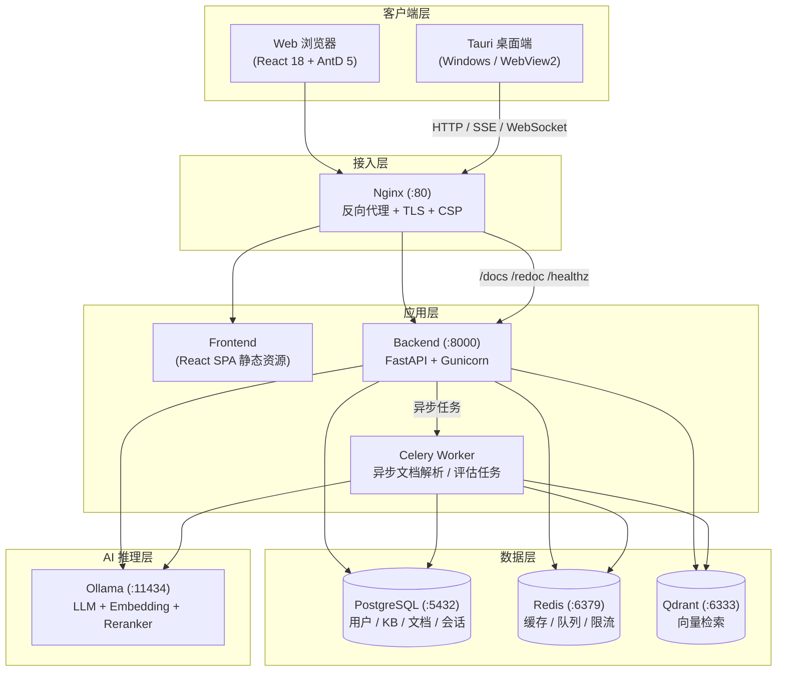
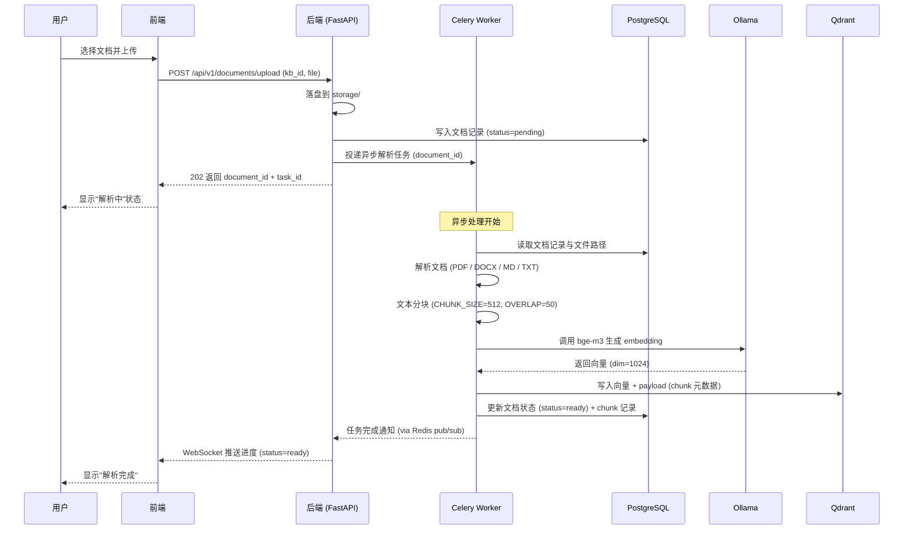
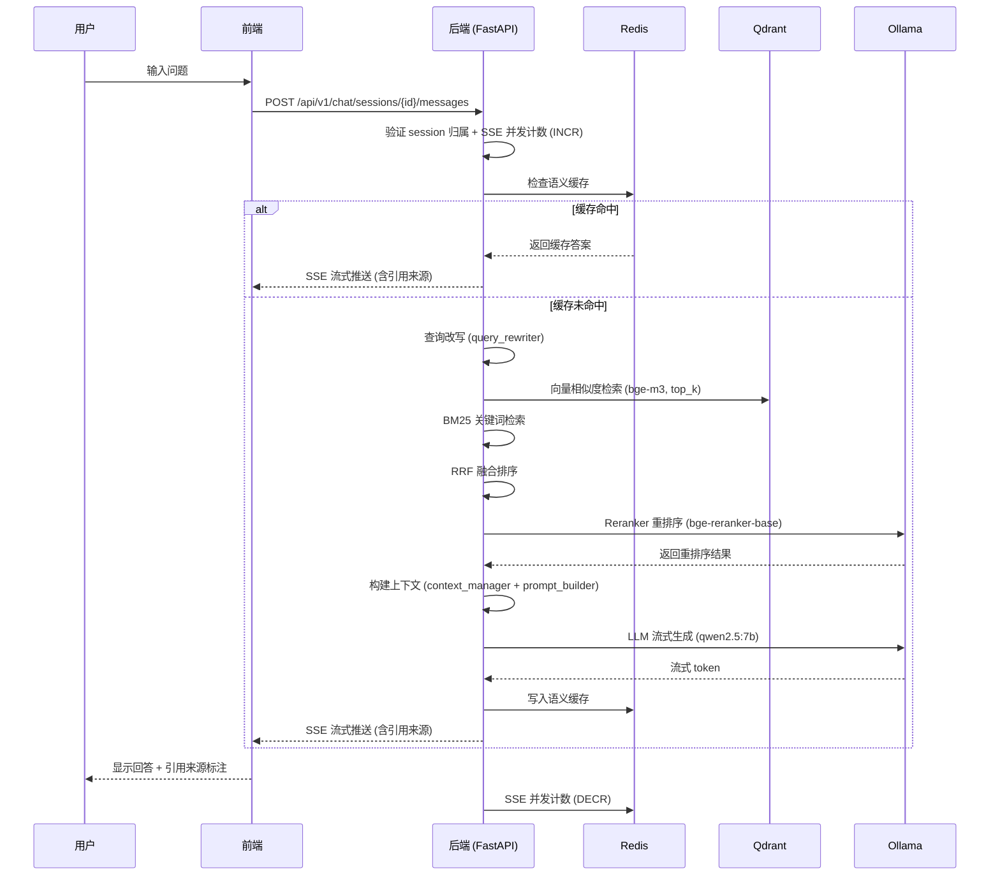

# RAG 知识库平台 — 部署文档

> 版本：v0.2.0
> 更新日期：2026-07-11

---

## 目录

1. [Docker Compose 部署](#1-docker-compose-部署)
2. [裸机部署](#2-裸机部署)
3. [环境变量完整说明](#3-环境变量完整说明)
4. [常见问题排查](#4-常见问题排查)
5. [回滚流程](#5-回滚流程)
6. [数据库备份](#6-数据库备份)
7. [灾难恢复](#7-灾难恢复)
8. [系统架构与数据流](#8-系统架构与数据流)

---

## 1. Docker Compose 部署

### 1.1 前置要求

- Docker 24.x+
- Docker Compose v2.24.x+
- 至少 8GB 可用内存（含 Ollama 模型）
- 至少 20GB 可用磁盘空间

### 1.2 快速启动

```bash
# 1. 克隆项目
git clone <repository-url> rag-platform
cd rag-platform

# 2. 配置环境变量
cp deploy/.env.example deploy/.env
# 编辑 deploy/.env，修改必要配置（尤其是 JWT_SECRET）

# 3. 启动所有服务
docker compose -f deploy/docker-compose.yml up -d

# 4. 查看服务状态
docker compose -f deploy/docker-compose.yml ps

# 5. 查看日志
docker compose -f deploy/docker-compose.yml logs -f backend
```

### 1.3 服务架构



### 1.4 服务说明

| 服务 | 镜像 | 端口 | 说明 |
|------|------|------|------|
| nginx | nginx:alpine | 80 | 反向代理，统一入口 |
| frontend | 自定义构建 | 80 (内部) | React SPA 静态文件 |
| backend | 自定义构建 | 8000 (内部) | FastAPI 后端 |
| celery_worker | 自定义构建 | — | 异步文档解析 |
| postgres | postgres:16-alpine | 5432 | 关系型数据库 |
| redis | redis:7-alpine | 6379 | 缓存与消息队列 |
| qdrant | qdrant/qdrant:v1.10.1 | 6333, 6334 | 向量数据库 |
| ollama | ollama/ollama:0.3.14 | 11434 | 本地 LLM 推理 |

### 1.5 首次启动后操作

```bash
# 1. 拉取 Ollama 模型（需要一些时间）
docker exec -it deploy-ollama-1 ollama pull qwen2.5:7b
docker exec -it deploy-ollama-1 ollama pull bge-m3

# 2. 数据库迁移已自动执行（backend 启动命令包含 alembic upgrade head）

# 3. 创建管理员账号
docker exec -it deploy-backend-1 python init_db.py
```

### 1.6 停止与清理

```bash
# 停止所有服务
docker compose -f deploy/docker-compose.yml down

# 停止并删除数据卷（慎用！）
docker compose -f deploy/docker-compose.yml down -v
```

---

## 2. 裸机部署

### 2.1 前置要求

- Ubuntu 22.04+ / Debian 12+ / CentOS Stream 9+
- Python 3.12+
- Node.js 20+
- PostgreSQL 15+
- Redis 7+
- Qdrant 1.10+
- Ollama（可选，用于本地 LLM 推理）

### 2.2 安装依赖

```bash
# Ubuntu/Debian
sudo apt update
sudo apt install -y python3.12 python3.12-venv python3.12-dev \
  postgresql postgresql-contrib redis-server \
  build-essential libpq-dev curl

# 安装 Poetry
curl -sSL https://install.python-poetry.org | python3 -

# 安装 Node.js 20
curl -fsSL https://deb.nodesource.com/setup_20.x | sudo -E bash -
sudo apt install -y nodejs
```

### 2.3 配置 PostgreSQL

```bash
sudo -u postgres psql <<EOF
CREATE USER rag WITH PASSWORD 'rag_password';
CREATE DATABASE rag_platform OWNER rag;
GRANT ALL PRIVILEGES ON DATABASE rag_platform TO rag;
\c rag_platform
GRANT ALL ON SCHEMA public TO rag;
EOF
```

### 2.4 配置 Redis

```bash
sudo systemctl enable redis-server
sudo systemctl start redis-server
```

### 2.5 安装 Qdrant

```bash
# 方式一：Docker
docker run -d --name qdrant \
  -p 6333:6333 -p 6334:6334 \
  -v qdrant_data:/qdrant/storage \
  qdrant/qdrant:v1.10.1

# 方式二：二进制安装
wget https://github.com/qdrant/qdrant/releases/download/v1.10.1/qdrant-x86_64-unknown-linux-gnu.tar.gz
tar -xzf qdrant-x86_64-unknown-linux-gnu.tar.gz
./qdrant
```

### 2.6 部署后端

```bash
cd backend

# 安装 Python 依赖
poetry install --without dev

# 配置环境变量
cp .env.example .env
# 编辑 .env，修改数据库连接、JWT_SECRET 等

# 运行数据库迁移
poetry run alembic upgrade head

# 初始化管理员账号
poetry run python init_db.py

# 启动后端（生产环境使用 Gunicorn + Uvicorn）
poetry run gunicorn app.main:app \
  -w 4 \
  -k uvicorn.workers.UvicornWorker \
  -b 0.0.0.0:8000 \
  --access-logfile - \
  --error-logfile -

# 启动 Celery Worker（另一个终端）
poetry run celery -A app.tasks.celery_app worker --loglevel=info --concurrency=2
```

### 2.7 部署前端

```bash
cd frontend

# 安装依赖
npm install

# 构建生产版本
npm run build

# 使用 Nginx 托管静态文件
sudo cp -r dist/* /var/www/html/

# 配置 Nginx（参考 deploy/nginx.conf）
sudo cp deploy/nginx.conf /etc/nginx/sites-available/rag-platform
sudo ln -s /etc/nginx/sites-available/rag-platform /etc/nginx/sites-enabled/
sudo nginx -t
sudo systemctl reload nginx
```

### 2.8 配置 Systemd 服务

创建 `/etc/systemd/system/rag-backend.service`：

```ini
[Unit]
Description=RAG Platform Backend
After=network.target postgresql.service redis-server.service

[Service]
Type=simple
User=www-data
WorkingDirectory=/opt/rag-platform/backend
ExecStart=/opt/rag-platform/backend/.venv/bin/gunicorn app.main:app \
  -w 4 -k uvicorn.workers.UvicornWorker -b 0.0.0.0:8000
Restart=always
RestartSec=5
EnvironmentFile=/opt/rag-platform/backend/.env

[Install]
WantedBy=multi-user.target
```

创建 `/etc/systemd/system/rag-celery.service`：

```ini
[Unit]
Description=RAG Platform Celery Worker
After=network.target redis-server.service

[Service]
Type=simple
User=www-data
WorkingDirectory=/opt/rag-platform/backend
ExecStart=/opt/rag-platform/backend/.venv/bin/celery -A app.tasks.celery_app worker --loglevel=info --concurrency=2
Restart=always
RestartSec=5
EnvironmentFile=/opt/rag-platform/backend/.env

[Install]
WantedBy=multi-user.target
```

```bash
sudo systemctl daemon-reload
sudo systemctl enable rag-backend rag-celery
sudo systemctl start rag-backend rag-celery
```

---

## 3. 环境变量完整说明

### 3.1 应用配置

| 变量 | 默认值 | 说明 |
|------|--------|------|
| `APP_NAME` | `RAG Platform` | 应用名称 |
| `DEBUG` | `false` | 调试模式（开启后显示 /docs 和 /redoc） |

### 3.2 数据库配置

| 变量 | 默认值 | 说明 |
|------|--------|------|
| `POSTGRES_HOST` | `localhost` | PostgreSQL 主机地址 |
| `POSTGRES_PORT` | `5432` | PostgreSQL 端口 |
| `POSTGRES_USER` | `rag` | 数据库用户名 |
| `POSTGRES_PASSWORD` | `<must-be-set-strong-random>` | **生产环境必须修改！** 数据库密码 |
| `POSTGRES_DB` | `rag_platform` | 数据库名称 |
| `DB_POOL_SIZE` | `20` | 连接池大小 |
| `DB_MAX_OVERFLOW` | `30` | 连接池最大溢出 |
| `DB_POOL_RECYCLE` | `3600` | 连接回收时间（秒） |
| `DB_POOL_PRE_PING` | `true` | 连接前检查可用性 |

### 3.3 Redis 配置

| 变量 | 默认值 | 说明 |
|------|--------|------|
| `REDIS_HOST` | `localhost` | Redis 主机地址 |
| `REDIS_PORT` | `6379` | Redis 端口 |
| `REDIS_DB` | `0` | Redis 数据库编号 |

### 3.4 Qdrant 配置

| 变量 | 默认值 | 说明 |
|------|--------|------|
| `QDRANT_HOST` | `localhost` | Qdrant 主机地址 |
| `QDRANT_PORT` | `6333` | Qdrant HTTP 端口 |
| `QDRANT_GRPC_PORT` | `6334` | Qdrant gRPC 端口 |

### 3.5 JWT 安全配置

| 变量 | 默认值 | 说明 |
|------|--------|------|
| `JWT_SECRET` | `<must-be-set-strong-random>` | **生产环境必须修改！** JWT 签名密钥 |
| `JWT_ALGORITHM` | `HS256` | JWT 签名算法 |
| `JWT_ISSUER` | `rag-platform` | JWT 签发者（iss 声明） |
| `JWT_AUDIENCE` | `rag-client` | JWT 受众（aud 声明） |
| `ACCESS_TOKEN_EXPIRE_MINUTES` | `30` | Access Token 有效期（分钟） |
| `REFRESH_TOKEN_EXPIRE_DAYS` | `7` | Refresh Token 有效期（天） |

### 3.6 LLM 配置

| 变量 | 默认值 | 说明 |
|------|--------|------|
| `OLLAMA_HOST` | `http://localhost:11434` | Ollama 服务地址 |
| `LLM_PROVIDER` | `ollama` | 默认 LLM Provider |
| `LLM_MODEL` | `qwen2.5:7b` | 默认 LLM 模型 |
| `LLM_PROVIDERS` | JSON 数组 | 多 Provider 配置（详见下方） |
| `LLM_PROVIDERS_JSON` | — | 多 LLM 提供商配置 JSON 字符串（与 `LLM_PROVIDERS` 等价，适用于环境变量注入场景，详见 3.15） |
| `LLM_ROUTING_STRATEGY` | `round_robin` | 路由策略 |
| `LLM_FALLBACK_ENABLED` | `true` | 是否启用 Fallback |
| `LLM_HEALTH_CHECK_INTERVAL` | `30` | 健康检查间隔（秒） |

### 3.7 Embedding 配置

| 变量 | 默认值 | 说明 |
|------|--------|------|
| `EMBEDDING_PROVIDER` | `ollama` | Embedding Provider |
| `EMBEDDING_MODEL` | `bge-m3` | Embedding 模型名称 |
| `EMBEDDING_DIM` | `1024` | 向量维度 |
| `EMBEDDING_CACHE_ENABLED` | `true` | 是否启用 embedding 缓存（避免重复向量化，降低 LLM 推理成本） |
| `EMBEDDING_CACHE_TTL` | `86400` | embedding 缓存 TTL（秒，默认 24 小时） |

### 3.8 Reranker 配置

| 变量 | 默认值 | 说明 |
|------|--------|------|
| `RERANKER_MODEL` | `BAAI/bge-reranker-base` | Reranker 模型名称 |

### 3.9 文档处理配置

| 变量 | 默认值 | 说明 |
|------|--------|------|
| `CHUNK_SIZE` | `512` | 分块大小（字符数） |
| `CHUNK_OVERLAP` | `50` | 分块重叠大小 |
| `MAX_FILE_SIZE_MB` | `20` | 最大文件上传大小（MB） |
| `MAX_DOCUMENTS_PER_KB` | `100` | 每个知识库最大文档数 |

### 3.10 CORS 配置

| 变量 | 默认值 | 说明 |
|------|--------|------|
| `CORS_ORIGINS` | `http://localhost:5173,http://localhost:1420,tauri://localhost` | 允许的跨域来源（逗号分隔） |

### 3.11 Celery 配置

| 变量 | 默认值 | 说明 |
|------|--------|------|
| `CELERY_BROKER_URL` | `redis://localhost:6379/1` | Celery Broker 地址 |
| `CELERY_RESULT_BACKEND` | `redis://localhost:6379/2` | Celery Result Backend |

### 3.12 日志配置

| 变量 | 默认值 | 说明 |
|------|--------|------|
| `LOG_LEVEL` | `info` | 日志级别 (debug/info/warning/error/critical) |
| `LOG_JSON` | `false` | 是否输出 JSON 结构化日志（生产环境建议开启，便于日志采集与检索） |

### 3.13 监控与可观测性配置

| 变量 | 默认值 | 说明 |
|------|--------|------|
| `METRICS_TOKEN` | — | Prometheus 抓取 `/metrics` 端点使用的 Bearer Token（生产环境必填，未设置则 metrics 端点不鉴权） |
| `OTEL_EXPORTER_OTLP_ENDPOINT` | — | OpenTelemetry OTLP 导出端点（如 `http://otel-collector:4317`，未设置则不上报 Trace） |

### 3.14 实时通信与限流配置

| 变量 | 默认值 | 说明 |
|------|--------|------|
| `WEBSOCKET_ENABLED` | `true` | 是否启用 WebSocket（用于实时通知与进度推送） |
| `SSE_MAX_CONCURRENT` | `100` | SSE 流式响应最大并发连接数（超出则拒绝新连接，防止资源耗尽） |
| `RATE_LIMIT_ENABLED` | `true` | 是否启用 API 速率限制（基于 Redis 计数器，保护后端免受突发流量冲击） |

### 3.15 LLM_PROVIDERS JSON 格式

```json
[
  {
    "name": "ollama",
    "type": "ollama",
    "api_base": "http://localhost:11434/v1",
    "model": "qwen2.5:7b",
    "priority": 99,
    "max_retries": 1,
    "timeout": 300,
    "fallback_to": null,
    "is_free": true
  },
  {
    "name": "openai",
    "type": "openai_compatible",
    "api_base": "https://api.openai.com/v1",
    "api_key": "sk-xxxxxxxxxxxxxxxxxxxx",
    "model": "gpt-4o",
    "priority": 50,
    "max_retries": 3,
    "timeout": 120,
    "fallback_to": "ollama",
    "is_free": false
  }
]
```

字段说明：
- `name`：Provider 唯一标识
- `type`：`ollama` 或 `openai_compatible`
- `api_base`：API 基础 URL
- `api_key`：API 密钥（仅 `openai_compatible` 类型）
- `model`：模型名称
- `priority`：优先级（数字越大越优先）
- `max_retries`：最大重试次数
- `timeout`：请求超时（秒）
- `fallback_to`：Fallback 目标 Provider 名称
- `is_free`：是否免费（用于成本统计）

---

## 4. 常见问题排查

### 4.1 数据库连接失败

**症状**：`could not connect to server: Connection refused`

**排查**：
```bash
# 检查 PostgreSQL 是否运行
sudo systemctl status postgresql
docker ps | grep postgres

# 检查连接
psql -h localhost -U rag -d rag_platform -c "SELECT 1"
```

**解决**：确保 PostgreSQL 正在运行，且 `.env` 中的连接信息正确。

### 4.2 Redis 连接失败

**症状**：`Error connecting to Redis`

**排查**：
```bash
redis-cli ping  # 应返回 PONG
```

**解决**：确保 Redis 正在运行，Docker 环境注意 `REDIS_HOST=redis`。

### 4.3 Qdrant 连接失败

**症状**：`ConnectionRefusedError` 或 Qdrant 相关错误

**排查**：
```bash
curl http://localhost:6333/collections
```

**解决**：确保 Qdrant 服务正在运行，Docker 环境注意 `QDRANT_HOST=qdrant`。

### 4.4 Ollama 模型未加载

**症状**：`model 'qwen2.5:7b' not found`

**排查**：
```bash
curl http://localhost:11434/api/tags
```

**解决**：
```bash
# Docker 环境
docker exec -it deploy-ollama-1 ollama pull qwen2.5:7b
docker exec -it deploy-ollama-1 ollama pull bge-m3

# 裸机环境
ollama pull qwen2.5:7b
ollama pull bge-m3
```

### 4.5 数据库迁移失败

**症状**：`alembic upgrade head` 报错

**解决**：
```bash
# 查看当前迁移版本
alembic current

# 查看迁移历史
alembic history

# 手动执行迁移
alembic upgrade head

# 如果需要重置（开发环境）
alembic downgrade base
alembic upgrade head
```

### 4.6 文件上传失败

**症状**：上传文件返回 400 或 413 错误

**排查**：
- 检查文件大小是否超过 `MAX_FILE_SIZE_MB`（默认 20MB）
- 检查文件格式是否在允许列表中（.pdf, .docx, .md, .txt）
- 检查 Nginx `client_max_body_size` 配置（默认 50M）

**解决**：
```bash
# 修改 .env
MAX_FILE_SIZE_MB=50

# 修改 Nginx 配置
# deploy/nginx.conf: client_max_body_size 100M;
```

### 4.7 SSE 流式中断

**症状**：SSE 连接在 Nginx 后断开

**解决**：确保 Nginx 配置包含以下设置：
```nginx
proxy_buffering off;
proxy_cache off;
proxy_read_timeout 300s;
proxy_set_header Connection '';
proxy_http_version 1.1;
```

### 4.8 内存不足

**症状**：OOM Killer 杀死进程，或服务响应极慢

**解决**：
- 减少 Gunicorn Worker 数量（`-w 2`）
- 使用云端 API 替代本地 Ollama
- 增加服务器内存或 Swap
- 限制 Celery Worker 并发数（`--concurrency=1`）

### 4.9 Token 验证失败

**症状**：401 错误，`Token has expired` 或 `Invalid token`

**排查**：
- `access_token` 有效期 60 分钟（默认），过期后用 `refresh_token` 刷新
- 检查系统时间是否正确
- 登出后 Token 会加入黑名单，需重新登录

### 4.10 端口冲突

**症状**：`port is already allocated`

**解决**：
```bash
# 查看占用端口的进程
sudo lsof -i :8000
sudo lsof -i :80

# 修改端口（在 .env 或 docker-compose.yml 中）
```

---

## 5. 回滚流程

### 5.1 代码回滚

```bash
# 查看历史版本
git log --oneline -10
# 回滚到指定版本
git checkout <prev-tag>
```

### 5.2 数据库回滚

```bash
# 查看迁移历史
alembic history
# 回滚一个版本
alembic downgrade -1
# 回滚到指定版本
alembic downgrade <revision>
```

### 5.3 服务重启

```bash
docker-compose down
docker-compose up -d
```

---

## 6. 数据库备份

平台内置自动化备份脚本 `deploy/scripts/backup_db.sh`，支持从环境变量读取 PostgreSQL 凭据、自动按日期类型（daily/weekly/monthly）生成备份并执行 7/30/365 天分级保留策略。

### 6.1 备份脚本

**用法**：

```bash
# 直接运行（需提前 export POSTGRES_* 环境变量或 source .env）
./deploy/scripts/backup_db.sh

# 试运行（不实际执行备份与清理，仅打印将要执行的操作）
./deploy/scripts/backup_db.sh --dry-run

# 通过 Makefile 运行（自动读取 deploy/.env 中的环境变量）
make backup

# 通过 Makefile 试运行
make backup ARGS=--dry-run
```

**环境变量**：

| 变量 | 默认值 | 说明 |
|------|--------|------|
| `POSTGRES_HOST` | `localhost` | PostgreSQL 主机地址 |
| `POSTGRES_PORT` | `5432` | PostgreSQL 端口 |
| `POSTGRES_USER` | — | 数据库用户名（必填） |
| `POSTGRES_PASSWORD` | — | 数据库密码（必填） |
| `POSTGRES_DB` | — | 数据库名称（必填） |
| `BACKUP_DIR` | `./backups` | 备份输出目录 |

### 6.2 备份类型与保留策略

脚本根据当前日期自动确定备份类型：

| 类型 | 触发条件 | 保留天数 | 文件名示例 |
|------|----------|----------|------------|
| `daily` | 每日 | 7 天 | `backup_daily_rag_platform_20260723_020000.dump` |
| `weekly` | 每周日 | 30 天 | `backup_weekly_rag_platform_20260720_020000.dump` |
| `monthly` | 每月 1 号 | 365 天 | `backup_monthly_rag_platform_20260701_020000.dump` |

备份使用 `pg_dump -F c`（custom 格式），支持并行恢复与选择性恢复。

### 6.3 定时备份（crontab）

```bash
# 每天凌晨 2 点自动备份（添加到 crontab -e）
0 2 * * *  cd /opt/rag-platform && set -a && . ./deploy/.env && set +a && ./deploy/scripts/backup_db.sh >> /var/log/rag-backup.log 2>&1
```

### 6.4 恢复备份

```bash
# 恢复指定备份文件
pg_restore -h localhost -U rag -d rag_platform -c backups/backup_daily_rag_platform_20260723_020000.dump

# 恢复到新数据库（避免覆盖现有数据）
pg_restore -h localhost -U rag -d rag_platform_restore -C backups/backup_daily_rag_platform_20260723_020000.dump
```

---

## 7. 灾难恢复

### 7.1 RPO/RTO 目标

| 指标 | 目标 | 说明 |
|------|------|------|
| RPO（恢复点目标） | 24h | 可容忍的数据丢失量（依赖每日 `pg_dump` 备份） |
| RTO（恢复时间目标） | 4h | 从故障发生到服务恢复的最长时间 |

> 达成 RPO/RTO 的前提：每日 2:00 自动备份（见 6.3）、Qdrant 快照、Redis AOF 持久化均已配置并验证可用。

### 7.2 Qdrant 备份

```bash
docker run --rm -v qdrant_data:/data -v $(pwd):/backup alpine tar czf /backup/qdrant_$(date +%Y%m%d).tar.gz /data
```

建议将 Qdrant 备份与 PostgreSQL 备份（见 6.1）一同纳入 crontab，每日执行，并归档到异地存储。

### 7.3 Redis AOF 持久化

为保证缓存与 Celery 队列状态持久化，建议在 `deploy/docker-compose.yml` 的 redis 服务中启用 AOF（**本文档仅说明所需变更，不实际修改 docker-compose.yml**）：

```yaml
services:
  redis:
    image: redis:7-alpine
    command: redis-server --appendonly yes
    volumes:
      - redis_data:/data
```

启用后 Redis 将在 `appendonly.aof` 文件中追加记录每次写操作，重启后自动重放恢复数据。

### 7.4 全栈恢复顺序

发生灾难需全栈恢复时，按以下顺序依次启动服务，前一层就绪后再启动下一层：

1. `postgres` — 关系型数据库（数据基座）
2. `redis` — 缓存与消息队列
3. `qdrant` — 向量数据库
4. `backend` — FastAPI 后端
5. `celery_worker` — 异步任务处理
6. `frontend` — 前端静态资源
7. `nginx` — 反向代理（统一入口，最后启动对外暴露）

```bash
# 按依赖顺序启动（Docker Compose 会处理 depends_on，但灾难恢复时建议逐个确认就绪）
docker compose -f deploy/docker-compose.yml up -d postgres
docker compose -f deploy/docker-compose.yml up -d redis qdrant
docker compose -f deploy/docker-compose.yml up -d backend
docker compose -f deploy/docker-compose.yml up -d celery_worker
docker compose -f deploy/docker-compose.yml up -d frontend nginx
```

### 7.5 数据卷损坏应急

当数据卷（postgres/qdrant）损坏无法正常启动时，从历史备份（`pg_dump` + Qdrant snapshot）重建数据卷：

```bash
# PostgreSQL 恢复
docker exec -i rag-platform-postgres-1 pg_restore -U rag -d rag_platform < backup.dump
# Qdrant 恢复
docker run --rm -v qdrant_data:/data -v $(pwd):/backup alpine sh -c "cd /data && tar xzf /backup/qdrant_20260723.tar.gz"
```

**应急流程**：

1. 停止相关服务：`docker compose -f deploy/docker-compose.yml stop backend celery_worker`
2. 删除损坏的数据卷（谨慎！确认已有备份后再操作）：
   ```bash
   docker compose -f deploy/docker-compose.yml down -v
   ```
3. 重新启动基础服务以创建空卷：`docker compose -f deploy/docker-compose.yml up -d postgres redis qdrant`
4. 执行上述 `pg_restore` 与 Qdrant tar 解压恢复数据
5. 按 7.4 顺序恢复上层服务
6. 校验数据完整性：检查文档数、向量集合数，并确认最近一次备份时间点之后产生的数据是否需要重新导入

---

## 8. 系统架构与数据流

本节使用 Mermaid 图展示系统的运行时架构与核心数据流，适用于 Docker Compose 与裸机两种部署模式。图表可在 [mermaid.live](https://mermaid.live) 中预览验证。

### 8.1 文档处理流程

文档上传后由 Celery Worker 异步完成解析、分块、向量化与入库，全程通过 WebSocket 向前端推送进度。



### 8.2 检索与对话流程

用户发起问答后，后端执行混合检索（BM25 + 向量）→ RRF 融合 → Rerank 重排序 → LLM 流式生成，通过 SSE 推送回前端。

